# Architecture Design: Multi-Tenant Point of Sale System

Last updated: 2026-05-11  
Document status: Draft, generated from repository scan  
Related document: [Product Requirements Document](./PRD.md)

## 1. Purpose

This document describes the current system architecture, service boundaries, data ownership, synchronous request flows, asynchronous event flows, and deployment topology for the multi-tenant POS platform.

The goal is to make the implementation understandable without reading every service. It reflects the codebase as scanned from `api-gateway`, `backend/*-service`, `frontend/app`, `backend/migrations`, `docker-compose.yml`, `observability`, and the `specs/` feature documents.

## 2. Architectural Style

The system uses a microservice architecture with a Next.js frontend, a Go + Echo API gateway, Go + Echo backend services, PostgreSQL as the primary database, Redis for ephemeral/cache state, Kafka in KRaft mode for asynchronous events, Vault Transit for encryption, MinIO/S3 for object storage, and Grafana stack components for observability.

Key principles:

- API gateway owns external HTTP routing, JWT validation, tenant context, subscription enforcement, rate limiting, and RBAC.
- Backend services own domain logic and data access for their bounded contexts.
- PostgreSQL is currently shared infrastructure, but service code maintains domain-level ownership over tables.
- Kafka is used for notifications, audit, consent, order analytics, and outbox-backed offline order events.
- Vault is used by services that read/write PII or sensitive credentials.
- Redis is used for sessions, cart persistence, analytics caching, rate limiting, and cleanup coordination.
- MinIO/S3 stores product photos and trace/log object data in local observability setups.

## 3. System Context

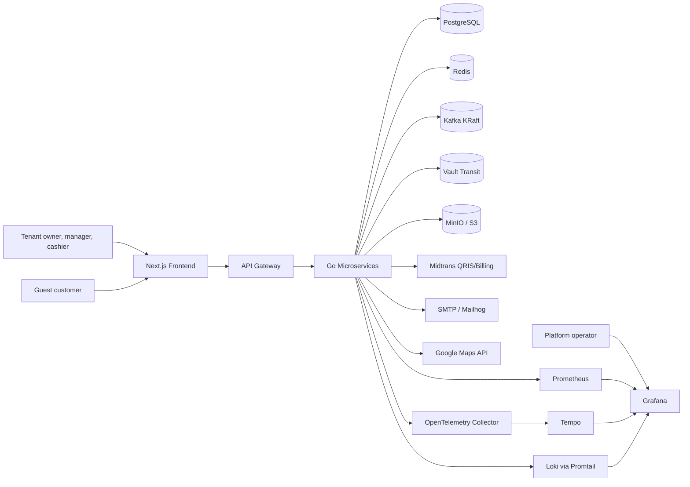

## 4. Container and Service Topology

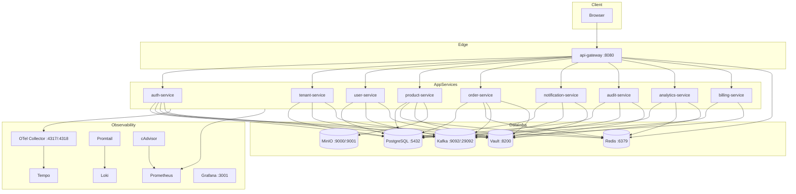

### 4.1 Local Ports

The root `.env.example` defines these external development ports:

| Component | External port |
| --- | --- |
| Frontend | `3000` |
| API gateway | `8080` |
| Auth service | `8082` |
| User service | `8083` |
| Tenant service | `8084` |
| Notification service | `8085` |
| Product service | `8086` |
| Order service | `8087` |
| Audit service | `8088` |
| Analytics service | `8089` |
| Billing service | `8090` |
| PostgreSQL | `5432` |
| Redis | `6379` |
| Kafka host listener | `9092` |
| MinIO API / console | `9000` / `9001` |
| Vault | `8200` |
| Grafana | `3001` |

Inside Docker, most Go services listen on `:8080` and are reached by service DNS names such as `auth-service:8080`.

## 5. Service Boundaries

| Service | Responsibilities | Primary owned data |
| --- | --- | --- |
| `api-gateway` | Reverse proxy, CORS, JWT auth, tenant scope, RBAC, subscription enforcement, public/protected route split | No durable domain tables |
| `auth-service` | Login, session, refresh, logout, account verification, password reset, auth events | `sessions`, `password_reset_tokens`, auth fields in `users` |
| `tenant-service` | Tenant registration, tenant profile, tenant config, Midtrans config, public plans, tenant data export | `tenants`, `tenant_configs`, plan/config data |
| `user-service` | Invitations, team membership flows, user notification preferences, user deletion jobs | `users`, `invitations`, `user_deletion_notifications` |
| `product-service` | Products, categories, inventory, stock adjustments, product photo metadata, public catalog | `products`, `categories`, `stock_adjustments`, `product_photos` |
| `order-service` | Guest cart, checkout, online orders, admin orders, offline orders, payment webhook, reservations, guest data rights | `guest_orders`, `order_items`, `payment_transactions`, `delivery_addresses`, `inventory_reservations`, `payment_terms`, `payment_records`, `event_outbox` |
| `notification-service` | Kafka event consumption, email template rendering, notification config/history/retry/resend | `notifications`, `notification_configs`, user notification preference reads |
| `audit-service` | Audit event ingestion/query, consent purposes, consent grant/revoke/status/history, privacy policy, compliance report | `audit_events`, `consent_purposes`, `consent_records`, `processed_consent_events`, `privacy_policies`, `retention_policies` |
| `analytics-service` | Dashboard metrics, product/customer rankings, sales trends, operational tasks, analytics caching | Read-heavy over order/product tables, Redis cache |
| `billing-service` | Subscription status, billing cycle, upgrades, invoices, invoice payment, billing webhooks | billing/subscription/invoice tables |

## 6. API Gateway Routing Model

The gateway exposes public routes for registration, login, password reset, public tenant config, public plans, public menu/product photos, guest ordering, webhooks, consent purposes, privacy policy, and consent grant.

Protected routes use JWT auth, tenant scope, and subscription enforcement. Additional RBAC is applied by route group:

| Gateway area | Target service | Access model |
| --- | --- | --- |
| `/api/tenants/register` | tenant-service | Public, rate limited |
| `/api/auth/*` | auth-service | Login/reset public; session/logout protected |
| `/api/public/*` | tenant/product services | Public catalog/config |
| `/api/v1/public/:tenantId/*` | order-service | Public guest cart/checkout/order flows |
| `/api/v1/webhooks/*` | order-service | Public provider webhook, service verifies signature |
| `/api/invitations*` | user-service | Accept public by token; create/resend owner/manager |
| `/api/v1/products*`, `/categories*`, `/inventory*` | product-service | Owner/manager |
| `/api/v1/admin/orders*`, `/offline-orders*` | order-service | Owner/manager/cashier |
| `/api/v1/admin/settings*` | order-service | Owner/manager |
| `/api/v1/notifications*` | notification-service | Owner/manager |
| `/api/v1/audit-events*`, `/consent-records*`, `/audit/tenant*` | audit-service | Owner |
| `/api/v1/tenant/data*` | tenant-service | Owner |
| `/api/v1/tenant/users/:user_id` | user-service | Owner |
| `/api/v1/analytics*` | analytics-service | Owner/manager |
| `/api/v1/billing*` | billing-service | Owner, bypasses subscription wall for remediation |

Design note: order-service also exposes public guest data rights routes without tenant ID (`/api/v1/public/orders/:order_reference/data` and `/delete`). Verify gateway coverage for these paths during release hardening.

## 7. Data Architecture

### 7.1 Logical Data Domains

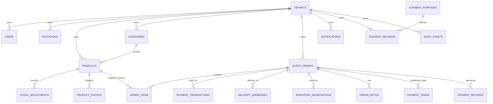

### 7.2 Shared PostgreSQL, Domain Ownership

The database is physically shared. Service ownership is logical and enforced in code by repositories, tenant filters, and RLS where enabled. This is pragmatic for the current repository, but it means schema changes must be coordinated across services.

Important tenant isolation patterns:

- Every tenant-owned table has a `tenant_id` where applicable.
- Gateway injects tenant/user context from JWT into headers or request context.
- Services query by tenant ID, not just resource ID.
- PostgreSQL RLS is enabled for products, categories, and stock adjustments in existing migrations.
- Cache keys should include tenant ID.
- Object storage keys use tenant-prefixed paths.
- Kafka events include tenant ID.

### 7.3 PII Storage Model

PII-bearing fields include user email/name, session identifiers/IP addresses, invitations, guest order customer details, delivery addresses, notification recipient/body/metadata, payment gateway credentials, and consent/audit metadata.

PII protection strategy:

- Application-layer encryption/decryption through Vault client utilities.
- Deterministic encryption or search hashes for fields that need lookup, such as email or phone.
- Expanded database columns for Vault ciphertext size.
- Log masking middleware in services.
- Audit events should avoid plaintext PII where possible.

### 7.4 Object Storage

Product photos are stored in MinIO/S3 with metadata in `product_photos`.

Object key shape:

```text
photos/{tenant_id}/{product_id}/{photo_id}_{timestamp}.{extension}
```

The metadata row tracks product, tenant, storage key, original filename, size, mime type, dimensions, display order, primary-photo flag, and timestamps. Tenant storage usage and quota are stored on `tenants`.

## 8. Synchronous Data Flows

### 8.1 Tenant Registration and Login

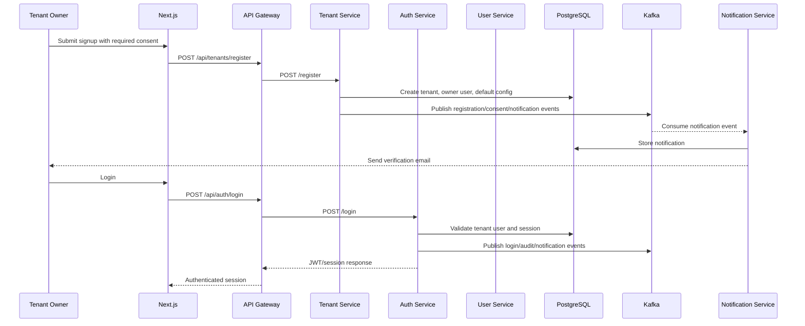

### 8.2 Product and Photo Management

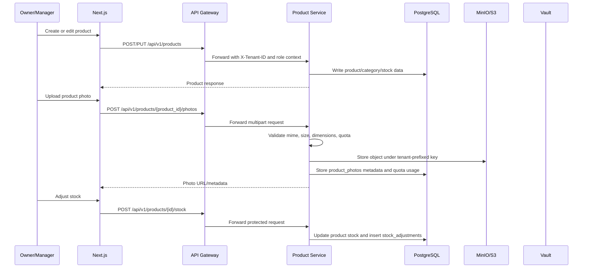

### 8.3 Online QRIS Guest Ordering

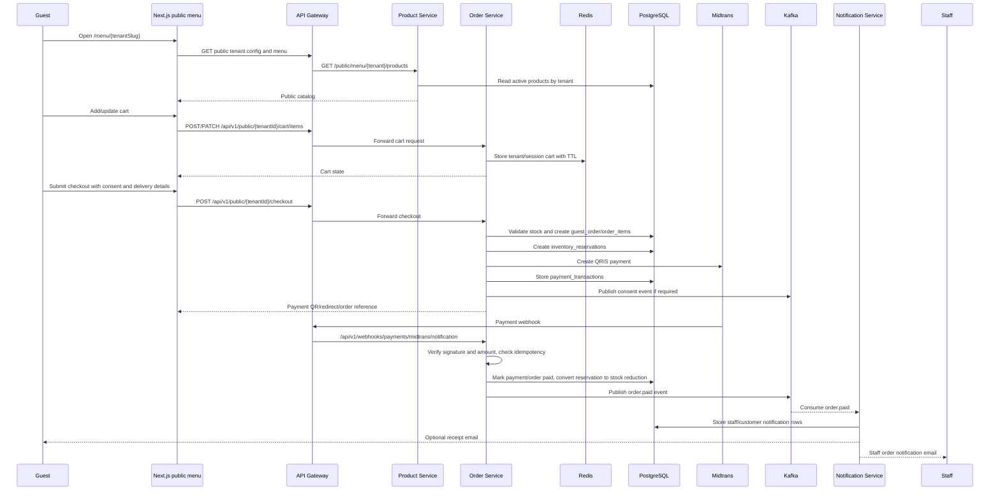

### 8.4 Offline Order with Installments

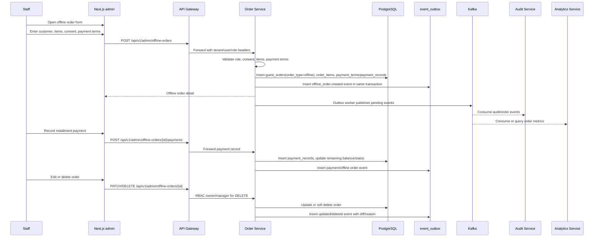

### 8.5 Consent and Data Rights

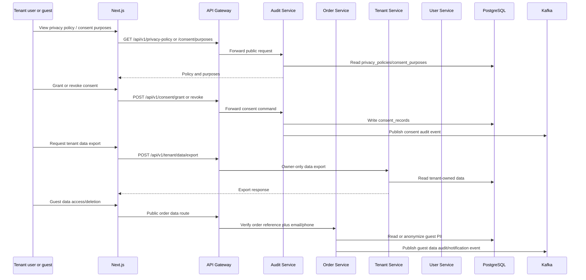

## 9. Asynchronous Event Architecture

Kafka is used for cross-service events where the caller should not block on side effects such as email delivery, audit persistence, analytics updates, or consent processing.

### 9.1 Known Topics and Event Types

| Topic | Producers | Consumers | Event examples |
| --- | --- | --- | --- |
| `notification-events` | auth, tenant, user, order, billing | notification-service | `user.registered`, `user.login`, `password.reset_requested`, `invitation.created`, `order.paid`, `guest_data_deleted`, billing/trial events |
| `audit-events` | auth, tenant, user, order, notification, audit consent service | audit-service | auth attempts, PII access, consent grant/revoke, tenant/user/order mutations |
| `consent-events` | tenant-service, order-service | audit-service | `consent.granted`, `consent.revoked` |
| `order-events` | order-service outbox | analytics/audit-oriented consumers | `offline_order.updated`, `offline_order.deleted`, order/payment events |
| `offline-orders-audit` | order-service outbox | audit-oriented consumers | `offline_order.created` in current service code |
| `email-notifications` | user cleanup jobs and notification flows | notification-service or worker | deletion warnings and email queue style events |

Note: feature specs sometimes name topics differently from current code. For example, offline order specs discuss `audit-events`, while current code also uses `offline-orders-audit` and `order-events`. Treat the code as current and normalize topic naming as a release-hardening task.

### 9.2 Notification Event Flow

```mermaid
flowchart LR
    Producer[Domain service] -->|publish event| Kafka[(notification-events)]
    Kafka --> Consumer[notification-service consumer group]
    Consumer --> Validate[Validate event schema]
    Validate --> Template[Render HTML/text template]
    Template --> Store[(notifications table)]
    Store --> SMTP[SMTP/Mailhog]
    SMTP --> Status[Update sent/failed/retry status]
    Status --> History[Notification history API]
```

### 9.3 Transactional Outbox Flow

Offline order writes use an outbox pattern for reliable event publication.

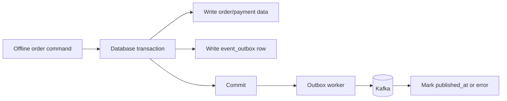

The outbox prevents a successful database write from losing its downstream event if Kafka is temporarily unavailable.

## 10. Cache and Ephemeral State

| Use case | Store | Key design |
| --- | --- | --- |
| User sessions | PostgreSQL and/or Redis depending on service flow | Session/JWT identifiers scoped to tenant/user |
| Guest carts | Redis | Tenant ID + session ID, TTL-controlled |
| Rate limiting | Redis/in-memory service rate limiters | Route/action plus identity/IP |
| Analytics cache | Redis | `analytics:tenant:{id}:...` style tenant-prefixed keys |
| Tenant/product/menu caching | Redis where implemented | Tenant-prefixed keys |
| Cleanup coordination | Redis | Distributed lock style keys |
| Presigned photo URL caching | Redis planned/partially documented | Tenant/product/photo key |

## 11. Security Architecture

### 11.1 Request Security

- Public endpoints are limited to registration, auth initiation, public catalog/config, guest cart/checkout/order status, privacy/consent discovery, and webhooks.
- Protected endpoints require JWT validation in the gateway.
- Gateway tenant scope middleware derives tenant context from claims and forwards it downstream.
- RBAC middleware gates owner, manager, cashier, and operational routes.
- Subscription middleware blocks non-billing protected routes for expired tenants.
- Provider webhooks are public at the gateway but verified in the receiving service.

### 11.2 Data Security

- Services use Vault client utilities for encryption/decryption of PII.
- Sensitive metadata can be encrypted before persistence.
- Search hashes support lookup over encrypted fields.
- Logs are masked with service-level middleware.
- PostgreSQL RLS is enabled for selected tenant-owned tables, and repository filters apply everywhere tenant ID is available.
- Product photo object keys are tenant-prefixed.
- Kafka events must include tenant ID and should avoid plaintext sensitive data unless required by the receiving domain.

### 11.3 Trust Boundaries

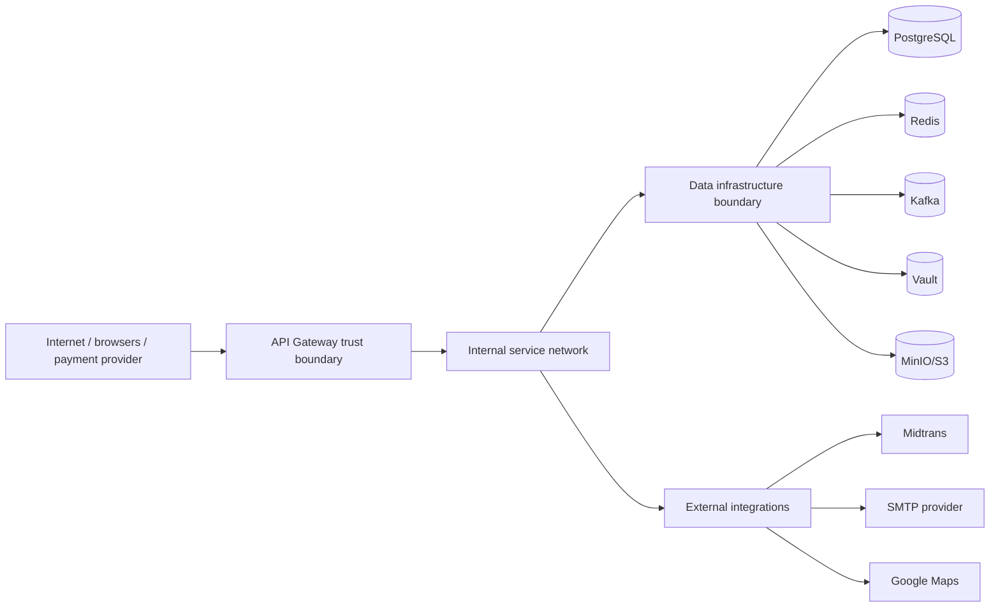

Controls at each boundary:

- Internet to gateway: CORS, rate limiting, auth, signature verification for webhooks.
- Gateway to services: JWT-derived headers, tenant scope, role scope, service DNS.
- Services to data: credentials, tenant filters, encryption, migrations, backups.
- Services to external providers: provider credentials, signed webhooks, retry/idempotency.

## 12. Observability Architecture

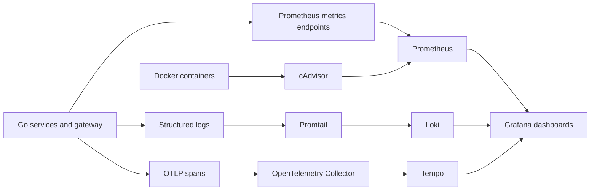

Implemented or documented observability surfaces:

- `/health` and `/ready` endpoints on most services.
- `/metrics` endpoints where Echo Prometheus middleware is registered.
- OpenTelemetry middleware in gateway/order/notification/product/audit style services.
- Audit trail dashboard.
- Offline orders dashboard.
- Cleanup alerts.
- Docker monitoring dashboard.
- Loki/Tempo object storage backed by MinIO in local observability compose.

## 13. Deployment Topology

### 13.1 Local Development

Root `docker-compose.yml` provides infrastructure and may include application services depending on current branch state. `observability/docker-compose.yml` provides Grafana, Prometheus, Loki, Promtail, Tempo, OTel collector, and cAdvisor.

Local development modes:

- Infrastructure in Docker, services run directly with `go run`/scripts.
- Full Docker Compose with service containers.
- Frontend run via `npm run dev` in `frontend`.

### 13.2 Production-leaning Topology

Production should separate:

- Public edge: TLS termination and API gateway.
- App services: separately deployable containers.
- Data plane: managed PostgreSQL, Redis, Kafka, Vault, object storage.
- Observability plane: metrics, logs, traces, dashboards, alerting.
- Secret management: Vault token and service credentials with least privilege.

## 14. Failure Handling

| Failure | Expected behavior |
| --- | --- |
| Notification provider down | Persist notification as failed/pending, retry; order processing continues |
| Kafka unavailable | Direct producers log failure; outbox-backed flows persist event for later publish |
| Midtrans duplicate webhook | Idempotency key prevents duplicate order/payment processing |
| Payment success but notification failure | Order remains paid; notification retries separately |
| Guest abandons checkout | Reservation cleanup releases inventory after TTL |
| Redis unavailable | Cart/session/cache/rate-limit features degrade or fail fast depending on service |
| Vault unavailable | PII read/write operations that require encryption/decryption fail; non-PII health may continue |
| MinIO/S3 unavailable | Photo upload fails gracefully; display paths use placeholder fallback where implemented |
| Analytics service unavailable | Dashboard metrics fail independently; transactional order flows continue |

## 15. Architecture Decisions

| Decision | Rationale | Tradeoff |
| --- | --- | --- |
| API gateway as auth/RBAC choke point | Centralizes external access control and tenant context | Services must trust forwarded context and still validate tenant filters |
| Shared PostgreSQL with logical service ownership | Simpler development and cross-feature reporting | Schema coupling between services |
| Kafka for asynchronous side effects | Decouples order/auth/consent from email, audit, analytics | Requires topic/schema governance and consumer monitoring |
| Transactional outbox for offline orders | Prevents lost audit/analytics events around critical writes | Adds polling worker and outbox cleanup complexity |
| Vault Transit for PII encryption | Centralized key management and auditability | Service availability depends on Vault for PII operations |
| MinIO/S3 for product photos | Avoids local filesystem coupling and supports production object storage | Requires URL, quota, bucket policy, and cleanup management |
| Extend `guest_orders` with `order_type` for offline orders | Reuses existing order model and analytics paths | Online/offline semantics must be carefully separated |
| Redis cart storage | Fast, TTL-based guest cart behavior | Cart state depends on Redis durability/availability |

## 16. Known Gaps and Verification Items

1. Normalize Kafka topic naming for offline order audit/order events.
2. Verify gateway routing for public guest data rights routes that do not include `:tenantId`.
3. Confirm tenant public URL strategy: slug vs UUID vs support for both.
4. Confirm canonical order status state machine across online and offline orders.
5. Convert skipped/TODO integration tests into executable tests for checkout, payment webhook, offline order lifecycle, analytics, and compliance flows.
6. Verify all app services are intentionally enabled or disabled in `docker-compose.yml` for the chosen local development mode.
7. Verify Vault key initialization, backups, token policies, and key rotation runbooks before production.
8. Verify MinIO/S3 bucket policies, object lifecycle cleanup, and tenant quota enforcement.
9. Verify analytics inclusion of offline installment payment lifecycle against real data.
10. Verify all PII-bearing Kafka event payloads are minimized, encrypted, or masked according to compliance expectations.

## 17. Quick Reference: Main Data Flows

| Flow | Synchronous path | Async path | Primary durable writes |
| --- | --- | --- | --- |
| Tenant registration | Frontend -> Gateway -> Tenant Service | notification/consent/audit events | `tenants`, `users`, `tenant_configs`, `consent_records`, `notifications` |
| Login | Frontend -> Gateway -> Auth Service | audit/notification events | `sessions`, audit/notification records |
| Product management | Frontend -> Gateway -> Product Service | audit where instrumented | `products`, `categories`, `stock_adjustments`, `product_photos` |
| Photo upload | Frontend -> Gateway -> Product Service -> MinIO/S3 | audit where instrumented | S3 object, `product_photos`, tenant quota |
| Guest online checkout | Frontend -> Gateway -> Order Service -> Midtrans | consent/order.paid/notification/audit events | `guest_orders`, `order_items`, `payment_transactions`, `inventory_reservations`, `delivery_addresses` |
| Payment webhook | Midtrans -> Gateway -> Order Service | `order.paid` to notification-service | `payment_transactions`, `guest_orders`, product stock/reservations |
| Offline order | Frontend -> Gateway -> Order Service | outbox -> Kafka -> audit/analytics | `guest_orders`, `order_items`, `payment_terms`, `payment_records`, `event_outbox` |
| Guest data deletion | Frontend -> Gateway -> Order Service | audit/notification event | anonymized `guest_orders`/`delivery_addresses`, `audit_events`, `notifications` |
| Dashboard analytics | Frontend -> Gateway -> Analytics Service | cache refresh by request/event consumers | Redis cache, reads from order/product tables |
| Billing payment | Frontend -> Gateway -> Billing Service -> Midtrans | billing/notification events | subscription/invoice/payment rows |

