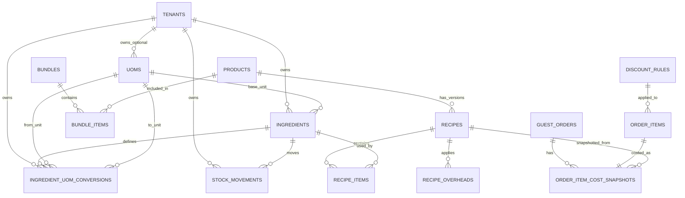
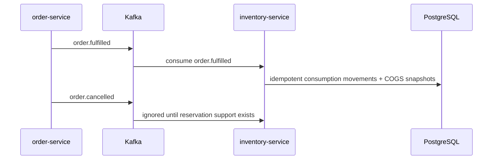

# Inventory, Recipe Costing, and Sales Planner Technical Design

## Current Architecture Findings

The repository is a Go + Echo microservice system behind `api-gateway`, with a shared PostgreSQL schema under `backend/migrations`, Redis, Kafka via `segmentio/kafka-go`, and a Next.js frontend. External authenticated routes are handled by the gateway, which injects `X-Tenant-ID`, `X-User-ID`, and `X-User-Role` headers.

Existing `product-service` inventory is product stock only: `products.stock_quantity` plus `stock_adjustments`. It uses integer quantities and is not suitable for ingredients, decimal unit conversion, food costing, or immutable stock movements. Phase 1 therefore adds a dedicated `inventory-service` and preserves the existing product catalog/order flows.

## Module Placement

- `product-service`: product catalog, product photos, categories, legacy product stock endpoints.
- `inventory-service`: UoMs, ingredients/raw materials, ingredient-specific conversions, stock movements, ingredient valuation, low-stock checks, recipes, bundle definitions, bundle COGS.
- `order-service`: publishes transactional outbox events for `order.fulfilled` and `order.cancelled`, owns discount rules, and stores order-item pricing snapshots.
- `analytics-service`: unchanged in Phase 1. Future phases will read historical sales and inventory readiness for deterministic planning.

## Database Model

Core rules:

- Quantities use `NUMERIC(18,6)`.
- Money uses `NUMERIC(18,2)` for totals and `NUMERIC(18,6)` for unit costs.
- UoMs may be global (`tenant_id IS NULL`) or tenant-scoped.
- Global conversions are allowed only within the same category.
- Packaging conversions require `ingredient_id`.
- `stock_movements` is the source of truth. `ingredients.current_stock_base` is a transactional cache.
- Recipes are inventory-owned version rows attached to `products.id`; only one active recipe exists per tenant/product.
- Recipe costing uses the current product selling price and current ingredient average costs.
- Order item COGS snapshots are immutable historical rows written when an order is fulfilled.
- Bundles are inventory-owned sale definitions that contain products; bundle COGS expands through product recipes instead of duplicating recipes.
- Order items use `item_type` plus either `product_id` or `bundle_id`; product order payloads remain backward compatible.
- Discount rules are order-service-owned price rules for product or bundle targets. Historical pricing is preserved on `order_items` and fulfillment COGS is preserved on `order_item_cost_snapshots`.

## API Plan

All routes are authenticated, tenant-scoped, and available to owner/manager through the gateway.

- `GET /api/v1/uoms`
- `POST /api/v1/uoms`
- `PUT /api/v1/uoms/:id`
- `DELETE /api/v1/uoms/:id`
- `GET /api/v1/ingredients`
- `GET /api/v1/ingredients/:id`
- `POST /api/v1/ingredients`
- `PUT /api/v1/ingredients/:id`
- `DELETE /api/v1/ingredients/:id`
- `GET /api/v1/ingredients/:id/conversions`
- `POST /api/v1/ingredients/:id/conversions`
- `PUT /api/v1/ingredients/:id/conversions/:conversionId`
- `DELETE /api/v1/ingredients/:id/conversions/:conversionId`
- `POST /api/v1/inventory/initial-stock`
- `POST /api/v1/inventory/purchases`
- `POST /api/v1/inventory/adjustments`
- `POST /api/v1/inventory/waste`
- `GET /api/v1/inventory/ingredients/:ingredientId/movements`
- `GET /api/v1/inventory/low-stock`
- `GET /api/v1/inventory/valuation`
- `GET /api/v1/products/:productId/recipe`
- `POST /api/v1/products/:productId/recipes`
- `GET /api/v1/products/:productId/recipes`
- `GET /api/v1/products/:productId/recipes/:version`
- `GET /api/v1/products/:productId/recipe/cost`
- `GET /api/v1/inventory/orders/:orderId/cost-snapshots`
- `GET /api/v1/inventory/orders/:orderId/profitability`
- `GET /api/v1/inventory/bundles`
- `POST /api/v1/inventory/bundles`
- `GET /api/v1/inventory/bundles/:id`
- `PUT /api/v1/inventory/bundles/:id`
- `DELETE /api/v1/inventory/bundles/:id`
- `GET /api/v1/inventory/bundles/:id/cost`
- `GET /api/v1/admin/discount-rules`
- `POST /api/v1/admin/discount-rules`
- `GET /api/v1/admin/discount-rules/:id`
- `PATCH /api/v1/admin/discount-rules/:id`
- `DELETE /api/v1/admin/discount-rules/:id`
- `POST /api/v1/admin/discount-rules/preview`

Decimal values are accepted and returned as JSON numbers while the service parses them into decimal values internally and stores them as PostgreSQL `NUMERIC`.

## Kafka Flow

Phase 3 implements fulfilled-order consumption only. The inventory consumer reads `order-events`, processes `order.fulfilled`, and ignores `order.cancelled` until reservation/release support is added. The consumer commits Kafka offsets only after successful database processing; missing recipes or insufficient stock keep the event uncommitted for retry.

`order.fulfilled` payload:

- `event_id`: stable logical event id, currently `order.fulfilled:<order_id>`.
- `event_type`: `order.fulfilled`.
- `tenant_id`
- `order_id`
- `order_reference`
- `order_type`
- `old_status`
- `new_status`
- `occurred_at`
- `items[]`: `order_item_id`, `item_type`, `product_id` for product lines, `bundle_id` for bundle lines, `product_name`, `quantity`, `list_unit_price`, `unit_price`, `total_price`, discount fields, and `pricing_snapshot`.

Inventory uses `event_id:order_item_id:ingredient_id` as the stock movement idempotency key and also checks the unique order-item snapshot before processing, so Kafka replay does not deduct stock twice.

For bundle lines, inventory loads the bundle, expands each bundle item into the product active recipe, and consumes ingredients with idempotency keys scoped by event, order item, bundle item, recipe, and recipe item. Bundle COGS snapshots store aggregate totals plus component recipe-cost JSON.

## Migration Plan

Phase 1 adds `000075_create_inventory_foundation.up.sql` and `.down.sql`.

The migration creates:

- `uoms`
- `ingredient_uom_conversions`
- `ingredients`
- `stock_movements`
- indexes for common tenant-scoped list/history/low-stock queries
- RLS policies for tenant-owned rows
- seeded global UoMs and global same-category conversions

Phase 2 adds `000076_create_recipe_costing.up.sql` and `.down.sql`.

The migration creates:

- `recipes`
- `recipe_items`
- `recipe_overheads`
- one active recipe constraint per tenant/product
- version uniqueness per tenant/product
- tenant indexes and RLS policies

Phase 3 adds `000077_create_order_item_cost_snapshots.up.sql` and `.down.sql`.

The migration creates:

- `order_item_cost_snapshots`
- unique `(tenant_id, order_item_id)` idempotency
- tenant/order/product indexes
- RLS policy for tenant-owned rows

Phase 4 adds `000078_create_bundles.up.sql` / `.down.sql` and `000079_create_discount_rules_and_pricing_snapshots.up.sql` / `.down.sql`.

The migrations create:

- `bundles`
- `bundle_items`
- `discount_rules`
- additive order item columns: `item_type`, `bundle_id`, `list_unit_price`, discount metadata, and `pricing_snapshot`

## Implementation Checklist

- Complete: scaffold `backend/inventory-service` from existing Go service conventions.
- Complete: add repositories for UoMs, ingredients, conversions, and stock movements.
- Complete: add services for validation, unit conversion, stock mutations, low-stock, and valuation.
- Complete: add handlers and route registration under `/api/v1`.
- Complete: add gateway route splitting so new ingredient inventory endpoints go to `inventory-service` and existing product inventory routes remain on `product-service`.
- Complete: add env examples, Docker Compose service block, README, and focused tests.
- Complete: add recipe models, repository, service, handlers, migration, gateway routes, and tests.
- Complete: add frontend inventory and recipe costing screens.
- Complete: add `order.fulfilled` outbox event publishing, inventory Kafka consumption, sale consumption ledger rows, and COGS snapshots.
- Complete: add bundle backend, bundle COGS expansion, discount backend, discount pricing preview, gateway routes, and bundle-aware fulfillment consumption.
- Complete: Phase 5 - Analytics and strategic dashboard backend APIs (profitability, forecasting, revenue/budget simulators, product recommendations).
- Pending: complete bundle/discount frontend, analytics planner frontend, and dashboard UI.

## Phase 2 Recipe Costing

Inventory-service owns product recipes and validates products by reading the shared `products` table with `tenant_id`. Product-service APIs remain unchanged.

Every recipe create request creates the next active version and deactivates any previous active version for that tenant/product in the same transaction. Recipe versions are immutable after creation.

Costing formulas:

- `ingredient_cost = normalized_quantity_base * average_cost_per_base_unit`
- `recipe_item_cost_with_waste = ingredient_cost * (1 + waste_percentage / 100)`
- `recipe_material_cost = sum(recipe_item_cost_with_waste) / yield_quantity`
- `fixed_overhead_cost = sum(FIXED overhead amounts)`
- `percentage_overhead_cost = recipe_material_cost * sum(PERCENTAGE overhead amounts) / 100`
- `total_cogs = recipe_material_cost + fixed_overhead_cost + percentage_overhead_cost`
- `gross_profit = product.selling_price - total_cogs`
- `gross_margin_percentage = gross_profit / product.selling_price * 100`, or `0` when selling price is zero

## Phase 3 Order Consumption

When an order transitions to `COMPLETE`, order-service writes an `order.fulfilled` outbox event in the same transaction as the status update. The outbox worker publishes that event to Kafka topic `order-events`.

Inventory-service consumes `order.fulfilled` events in one tenant-scoped transaction:

1. Skip any order item that already has a cost snapshot.
2. Load the active recipe version for each product.
3. Lock each ingredient row with `FOR UPDATE`.
4. Reject the transaction when an ingredient is inactive, missing, or would go negative.
5. Create one `SALE_CONSUMPTION` stock movement per recipe ingredient.
6. Update `ingredients.current_stock_base` without changing average cost.
7. Write an immutable `order_item_cost_snapshots` row with recipe version, material cost, overhead cost, total COGS, selling price, gross profit, and gross margin.

Order profitability reads aggregate the immutable snapshots rather than recalculating from current recipe or ingredient prices.

## Phase 5 Analytics And Strategic Dashboard

The analytics-service provides inventory-aware analytics endpoints that read from `order_item_cost_snapshots` and `stock_movements` tables.

### API Endpoints

- `GET /api/v1/analytics/inventory/profitability` — Product profitability analysis with COGS, gross profit, and margin metrics
  - Query params: `start_date`, `end_date`, `limit` (default 20)
  - Returns: top products by gross profit with revenue, COGS, quantity sold, and margin percentage

- `GET /api/v1/analytics/inventory/forecast` — Ingredient usage forecast based on historical consumption
  - Query params: `start_date`, `end_date`
  - Returns: ingredient usage summary, daily burn rate, stock after forecast, days until stockout

- `POST /api/v1/analytics/inventory/simulate/revenue` — Revenue target simulator
  - Body: `{ "target_revenue": "10000000", "start_date": "2026-07-01", "end_date": "2026-07-31" }`
  - Returns: recommended product mix, estimated ingredient usage, projected budget, gross profit, feasibility score

- `POST /api/v1/analytics/inventory/simulate/budget` — Budget-based simulator
  - Body: `{ "budget_amount": "5000000", "start_date": "2026-07-01", "end_date": "2026-07-31" }`
  - Returns: recommended mix within budget, ingredient breakdown, projected revenue and profit

- `GET /api/v1/analytics/inventory/recommendations` — Explainable product recommendation scoring
  - Returns: top 20 products scored by margin (35%), velocity (25%), stock readiness (25%), trend (15%)

### Scoring Weights

Product recommendations use deterministic scoring:
- **Margin Score (35%)**: Based on gross margin percentage
- **Velocity Score (25%)**: Based on 30-day sales velocity
- **Stock Readiness Score (25%)**: Based on recent sales activity
- **Trend Score (15%)**: Based on margin trend direction

No AI/ML is used; all calculations are deterministic and explainable.

## Phase 4 Bundles And Discounts

Bundles are saleable groups of products. MVP rules:

- Inventory-service owns bundle definitions.
- `bundle_items` references products only; nested bundles are not supported.
- Bundle COGS is the sum of each component product active recipe COGS multiplied by the bundle item quantity.
- Fulfillment for a bundle line consumes ingredients from each component product recipe.
- Bundle order lines use `item_type=bundle` and `bundle_id`; existing product lines use `item_type=product` and `product_id`.

Discount rules are order-service-owned:

- `target_type`: `product` or `bundle`
- `target_id`: product or bundle UUID
- `discount_type`: `percentage` or `fixed_amount`
- `starts_at` / `ends_at`
- `is_active`
- `exclusive` defaults to true
- `priority` controls which single MVP rule is selected when auto-applying discounts

Historical order pricing is stored on `order_items` with list price, final unit price, total price, discount rule metadata, discount amount, and JSON pricing snapshot. COGS remains in inventory snapshots so discounts do not retroactively change historical profitability.

## Risks And Assumptions

- Existing migration numbering has gaps and fallback behavior in `scripts/run-migrations.sh`; the new migration must be included in the targeted fallback if needed later.
- Existing product prices use floats in Go, but this module uses decimal-safe storage and parsing because ingredient quantities and costs require precision.
- Full frontend `test:ci` and `lint` are currently blocked by unrelated repository issues listed in the verification notes; inventory backend verification is green.
- Order consumption intentionally occurs on `COMPLETE` / `order.fulfilled`, not on `PAID`.
- Online checkout currently writes no-discount pricing snapshots; discount application for public carts is deferred until cart rows carry item type and pricing intent.
